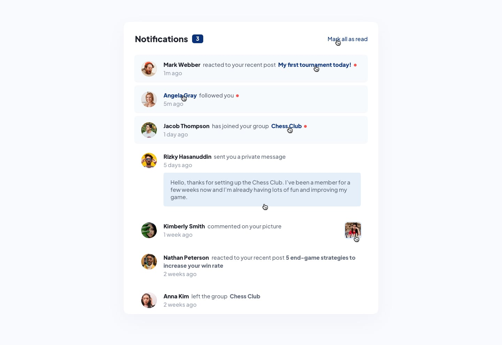
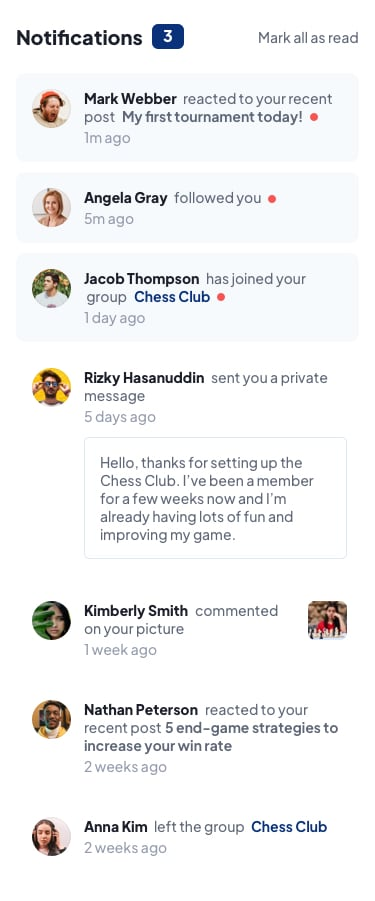

# Frontend Mentor - Solución de la página de notificaciones

Esta es mi solución al desafío **Notifications Page** de Frontend Mentor. Este proyecto se centra en construir una interfaz de notificaciones adaptable utilizando React y Tailwind CSS v4.

El desafío me permitió practicar la creación de componentes reutilizables, el uso de props, el renderizado condicional, el renderizado de listas desde un archivo JSON, los diseños adaptables con Flexbox y la preparación de un build de producción con Vite para GitHub Pages.

---

## Tabla de contenidos

* [Descripción general](#descripción-general)
* [El desafío](#el-desafío)
* [Diseño](#diseño)
* [Enlaces](#enlaces)
* [Mi proceso](#mi-proceso)
* [Tecnologías utilizadas](#tecnologías-utilizadas)
* [Lo que aprendí](#lo-que-aprendí)

---

## Descripción general

Este proyecto muestra siete notificaciones que incluyen reacciones a publicaciones, un nuevo seguidor, cambios de miembros en un grupo, un mensaje privado y un comentario en una imagen.

Cada notificación contiene un avatar, un nombre, una descripción de la actividad y el tiempo transcurrido. Dependiendo de su tipo, también puede incluir el título de una publicación, el nombre de un grupo, un mensaje o una imagen.

Las notificaciones no leídas se distinguen mediante un color de fondo diferente y un indicador rojo. La interfaz sigue un enfoque mobile-first, con espacios adicionales y esquinas redondeadas en el contenedor para pantallas más grandes.

**Estado actual:** los datos se almacenan en un archivo JSON estático. El contador de notificaciones no leídas está fijado en `3`. El botón **Mark all as read** tiene estilos, pero todavía no implementa la acción de marcar las notificaciones como leídas ni actualizar el contador.

---

## El desafío

La interfaz permite:

* Visualizar un diseño que se adapta al tamaño de la pantalla.
* Distinguir entre notificaciones leídas y no leídas.
* Consultar diferentes tipos de notificaciones en una misma lista.
* Leer un mensaje privado dentro de su notificación.
* Visualizar la imagen asociada a un comentario.
* Observar cambios de estilo al pasar el cursor sobre determinados elementos.

La interacción pendiente consiste en marcar todas las notificaciones como leídas y actualizar el contador al pulsar el botón **Mark all as read**.

---

## Diseño

Las siguientes imágenes son las referencias de diseño proporcionadas para el desafío, no capturas de la implementación.

### Diseño de escritorio

### Estados activos

### Diseño móvil

---

## Enlaces

* Repositorio: [Repositorio en GitHub](https://github.com/mlopezl/notification-page)
* Sitio en GitHub Pages: [Página de notificaciones](https://mlopezl.github.io/notification-page/) — requiere activar GitHub Pages y publicar el build generado.

---

## Mi proceso

* Organicé la aplicación utilizando componentes funcionales reutilizables de React.
* Agrupé los componentes de notificaciones dentro de `src/components/notifications/`.
* Dividí la interfaz en un contenedor, un encabezado, un título, un botón y una lista de notificaciones.
* Creé componentes específicos para los avatares, el contenido, los tiempos, los mensajes, las imágenes y los indicadores de notificaciones no leídas.
* Almacené la información en `src/notifications.json`, separando los datos de su presentación.
* Rendericé las notificaciones con `.map()` y utilicé el `id` de cada una como su `key` en React.
* Pasé las propiedades de cada notificación explícitamente al componente `Notification` mediante props.
* Utilicé un objeto para seleccionar la descripción de la actividad según el tipo de notificación.
* Apliqué renderizado condicional para mostrar mensajes privados, imágenes e indicadores de notificaciones no leídas.
* Cambié el color de fondo según el valor de la propiedad `isNew`.
* Construí la distribución con Flexbox y las clases de utilidad de Tailwind CSS v4.
* Definí los colores del proyecto y la fuente Plus Jakarta Sans mediante la configuración `@theme` de Tailwind.
* Añadí estilos hover y transiciones CSS a determinados elementos.
* Antepusé `import.meta.env.BASE_URL` a las rutas de las imágenes del JSON para que funcionen dentro de la ruta del repositorio en GitHub Pages.
* Configuré Vite para generar el build de producción directamente en `docs`.
* Añadí `public/.nojekyll`, que se copia al build de producción.
* Excluí los archivos generados en `docs` del análisis de ESLint.

### Ejecutar el proyecto localmente

Instalar las dependencias e iniciar el servidor de desarrollo:

~~~bash
pnpm install
pnpm run dev
~~~

Abrir la dirección local que Vite muestra en la terminal.

### Validar y generar el build

~~~bash
pnpm run lint
pnpm run build
~~~

Los archivos de producción se generan en `docs`. Para previsualizar el build localmente:

~~~bash
pnpm run preview
~~~

### Publicar en GitHub Pages

El proyecto utiliza la siguiente configuración de Vite:

~~~js
export default defineConfig({
  base: '/notification-page/',
  build: { outDir: 'docs' },
  plugins: [react(), tailwindcss()],
})
~~~

Después de generar el build, guardar los cambios en un commit y subir los archivos fuente y la carpeta `docs` al repositorio.

En **Settings > Pages** del repositorio:

1. Seleccionar **Deploy from a branch**.
2. Elegir la rama **main**.
3. Seleccionar la carpeta **/docs**.
4. Guardar la configuración.

Para futuras actualizaciones, ejecutar nuevamente `pnpm run build` e incluir los archivos regenerados de `docs` en el commit junto con los cambios del código fuente.

---

## Tecnologías utilizadas

* React 19
* JSX
* JavaScript (ES6+)
* Props y composición de componentes de React
* Renderizado condicional
* Renderizado dinámico de listas con `.map()`
* Datos en formato JSON
* Tailwind CSS v4
* Flexbox
* Diseño adaptable con enfoque mobile-first
* Transiciones CSS y estados hover
* Fuente Plus Jakarta Sans
* Imágenes en formato WebP
* Vite
* PNPM
* ESLint
* Configuración de publicación para GitHub Pages

---

## Lo que aprendí

* Dividir una interfaz de notificaciones en componentes pequeños y reutilizables.
* Pasar datos entre componentes padre e hijo utilizando props.
* Separar los datos de las notificaciones de la interfaz mediante un archivo JSON.
* Renderizar una lista de componentes con `.map()` en lugar de repetir el JSX manualmente.
* Utilizar valores únicos y estables para la prop `key`.
* Comprender la relación entre las props explícitas y la sintaxis de propagación de propiedades en JSX.
* Seleccionar descripciones de actividad mediante un objeto cuyas claves corresponden a los tipos de notificación.
* Mostrar contenido opcional utilizando renderizado condicional.
* Aplicar estilos diferentes a las notificaciones leídas y no leídas según una propiedad booleana.
* Construir diseños adaptables con Tailwind CSS y Flexbox.
* Definir colores y tipografía personalizados con Tailwind CSS v4.
* Gestionar las rutas de imágenes públicas cuando la aplicación se aloja en una subcarpeta.
* Configurar las opciones `base` y `build.outDir` de Vite para GitHub Pages.
* Generar un build de producción y comprobar el código fuente con ESLint.
* Distinguir entre un control con estilos y una interacción implementada: el siguiente paso es agregar la funcionalidad para marcar las notificaciones como leídas.